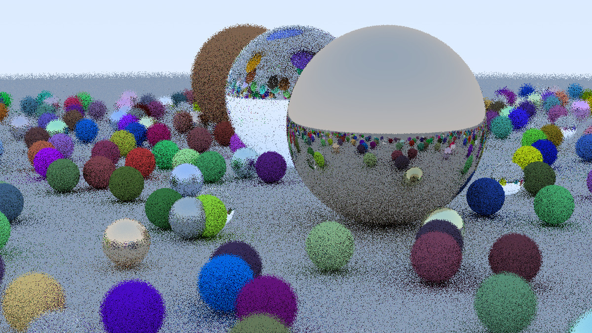

# Ray Tracing

这是一个使用 C++ 编写的基础光线追踪渲染器，实现了从摄像机出发发射光线、击中物体并计算像素颜色的基本流程。

## 🌟 功能特性

- 支持多个球体、地面
- 实现了漫反射（Diffuse）和金属反射（Metal）
- 支持景深（Depth of Field）
- 支持抗锯齿（多重采样）
- 支持可调节分辨率与采样数
- 输出为 PPM 格式图像

## 🖼️ 效果展示

> 使用 1200x675 分辨率，1 样本/像素渲染结果。



> 使用 1200x675 分辨率，500 样本/像素渲染结果。

## 🛠 编译与运行

### 依赖

- C++11 或更高版本编译器
- 支持 `make` 或 `g++`

### make编译

```bash
mkdir build
cd build
cmake ..
make
```

### 运行

```bash
./bin/rayTracer > output.ppm
```
### g++编译

```bash
g++ -g main.cpp -o main.exe
```
### 运行

```bash
.\main.exe > output.ppm
```

你可以使用 ImageMagick 或 Photoshop 等工具查看 `.ppm` 图片。

---

## 🧮 文件结构

```
ray-tracing/
├── main.cpp           # 主程序入口
├── camera.h           # 相机类（支持景深）
├── ray.h              # 光线类
├── hittable.h         # 可被击中的物体接口
├── sphere.h           # 球体实现
├── material.h         # 材质实现（漫反射、金属等）
├── utils.h            # 工具函数（随机数等）
├── output.ppm         # 渲染输出图像（运行后生成）
└── README.md          # 项目说明文件
```

---

## 📚 参考资料

- [Ray Tracing in One Weekend](https://raytracing.github.io/)

---

## 📄 License

本项目遵循 MIT 开源许可协议，欢迎学习与扩展。
